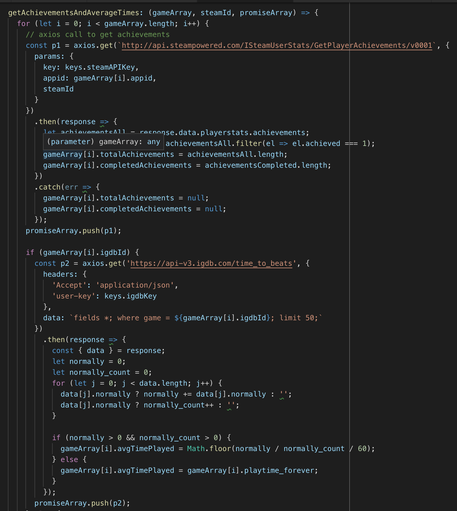

# Vapor

Live Demo: https://vapor-js.herokuapp.com/

## Overview

This app is a game visualization tool for Steam games. The user can look up games in the Steam store and find out cool statistics about them. Additionally, an user can login with their Steam account and find additional information about the games they've played and some unique information such as their dedication score. 

## Technologies

* Javascript
* React
* MongoDB
* Express.js
* Node.js
* HTML5 / CSS3 / SCSS
* Webpack

## Installation
(_run from project root folder_)

### Install dependiencies for server/client :
`npm run client-install`
* Install dependencies from both folders

### Start client dev server
`npm run client`

### Start servers for both client and server
`npm run dev`

## Features

This app uses a lot of api calls from Steam and IGDB. Because the Steam library does not contain all video games, we decided to use IGDB in order to make game lookups possible for any game. Also, IGDB was able to provide games screenshots and some additional statistics that we use to make comparisons. 

One challenge of our project was to combine entries in the IGDB database with those in the Steam database when making API calls. To do this, we had to 'sanitize' our search entries to be compatible with IGDB and then find the corresponding Steam game id. Here is an example of one such API call:

Utilizing both API's, we were able to put together some unique statistics and create a great tool for our users. 
